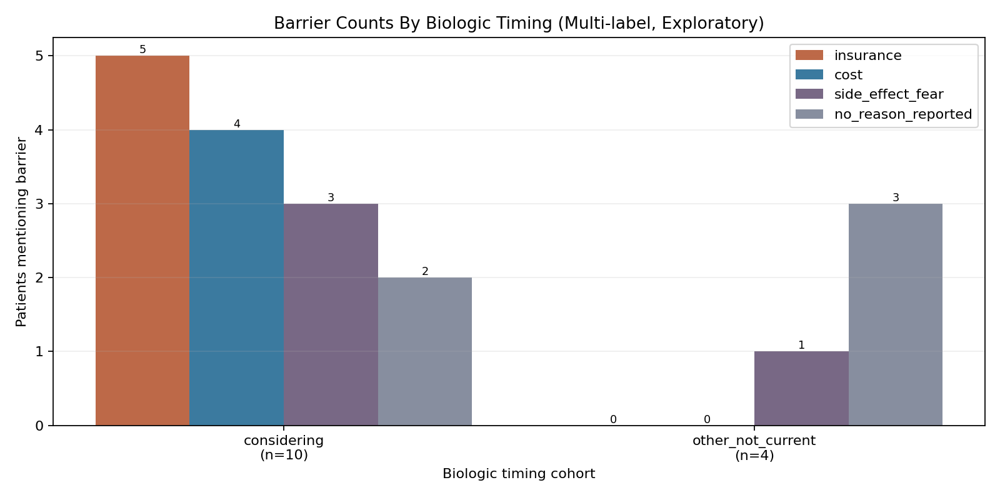
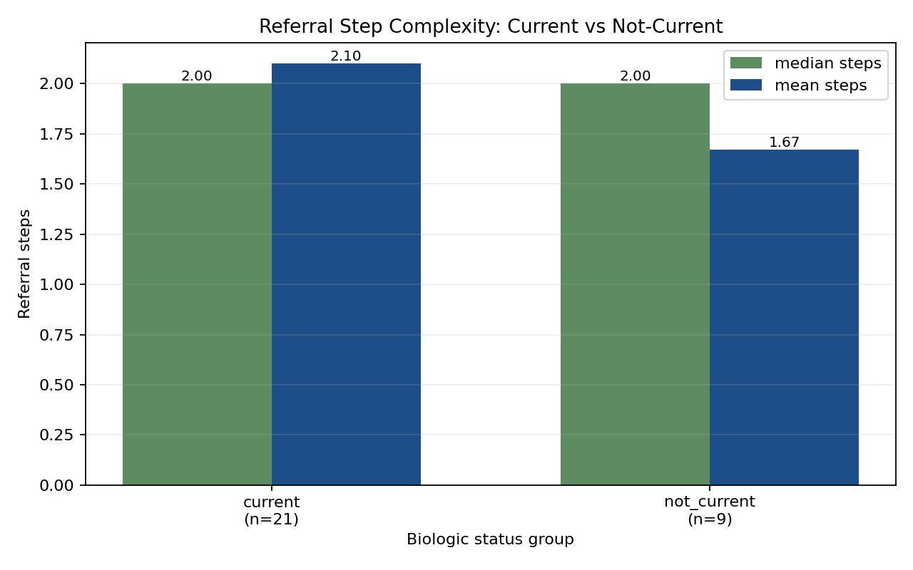
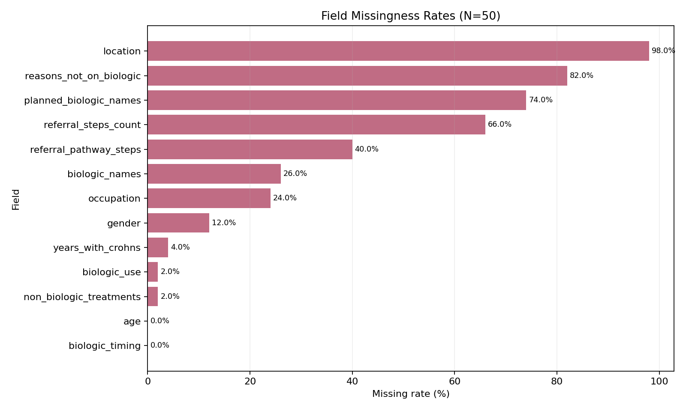

# mama health - Data Scientist Challenge Solution

<a id="toc"></a>
## Table Of Contents

- [Executive Summary](#executive-summary)
- [Reproducibility](#reproducibility)
- [Pre-Analysis QA And Assumptions](#pre-analysis-qa-and-assumptions)
- [Business Questions](#business-questions)
- [Data Limitations (Churn and Incompleteness)](#data-limitations-churn-and-incompleteness)
- [Methodology](#methodology)
- [Schema Design Rationale (Pydantic)](#schema-design-rationale-pydantic)
- [Commercial Implications (With Caveats)](#commercial-implications-with-caveats)
- [Optional Engineering Extras Implemented](#optional-engineering-extras-implemented)

## Executive Summary

- Sample size: `N=50` synthetic interviews (`n=14` not-current subgroup for barrier analysis).
- Current biologic prevalence: `36/50` (`72.0%`), or `73.47%` on known-timing records.
- Main barriers for not-on-biologic cohort (`n=14`): `insurance`, `cost`, `side_effect_fear`.
- Typical referral depth (where inferable): median `2` steps.
- Churn/incompleteness is material (`8` churn-suspected, high missingness in referral/location fields), so findings are directional.


## Reproducibility

### 1. Setup

```bash
python3 -m venv .venv
source .venv/bin/activate
pip install -r requirements.txt
```

### 2. Run extraction (Gemini)

```bash
set -a && source .env && set +a
.venv/bin/python -m src.extract --out data/extracted.jsonl --model gemini/gemini-2.0-flash-lite --metrics-out data/extraction_metrics.jsonl
```

### 3. Run analysis

```bash
.venv/bin/python -m src.analyze --in data/extracted.jsonl --out data/analysis_summary.json
```

### 4. Generate charts

```bash
.venv/bin/python -m src.plot_analysis --summary data/analysis_summary.json --extracted data/extracted.jsonl --out-dir data/figures
```

### 5. Run Hugging Face OS-model baseline (optional)

```bash
.venv/bin/python -m src.hf_reason_baseline --interviews data/interviews.json --extracted data/extracted.jsonl --out data/hf_reason_baseline.json --model valhalla/distilbart-mnli-12-1 --threshold 0.55 --sweep-thresholds 0.45,0.55,0.65
```

Primary outputs:
- `data/extracted.jsonl`
- `data/extraction_metrics.jsonl` (generated locally; git-ignored)
- `data/analysis_summary.json`
- `data/hf_reason_baseline.json`
- `data/figures/*.png`
- `data/figures/referral_pathway_sankey.html`

Run timestamp for results below: February 13, 2026.

[Back to Table of Contents](#toc)

## Pre-Analysis QA And Assumptions

Data QA checks were run before analysis:
- Records analyzed: 50
- Schema consistency issues found: 0
- Biologic timing distribution: `current=36`, `considering=10`, `planned=1`, `past=1`, `never=1`, `unknown=1`

Important missingness:
- `location`: 98% missing
- `referral_steps_count`: 66% missing
- `referral_pathway_steps`: 40% missing
- `gender`: 12% missing

Assumptions used for business calculations:
- "On biologic" is defined as `biologic_timing == "current"`.
- Sensitivity view excludes `biologic_timing == "unknown"` from denominator.
- "Not on biologic" cohort includes all records where `biologic_timing != "current"`.

### Sample Size Context

- Dataset size is `N=50` synthetic interviews; this is useful for directional exploration, not stable inference.
- Cross-factor charts that compare subgroups can become very noisy quickly at this sample size.
- The not-on-biologic cohort is only `n=14`, so percentages in that slice should be interpreted cautiously.
- These patterns should be re-evaluated on a materially larger dataset before commercial decisions.

[Back to Table of Contents](#toc)

## Business Questions

### 1. What percentage of patients appear to be on a biologic treatment?

- `36/50` are currently on biologic treatment (`72.0%`).
- Sensitivity on known-timing records: `36/49` (`73.47%`).

### 2. For patients not on a biologic, what are the primary reasons?

Not-on-biologic cohort size: `14` patients.

Reason counts (non-mutually-exclusive):
- `insurance`: 5 (`35.71%` of not-current cohort)
- `cost`: 4 (`28.57%`)
- `side_effect_fear`: 4 (`28.57%`)
- `needle_fear`: 1 (`7.14%`)
- `doctor_advice`: 1 (`7.14%`)

Interpretation:
- Access barriers (insurance + cost) are the strongest observed blockers.
- Safety concern (side-effect fear) is similarly prominent.

Supportive cross-factor view (exploratory, small-sample):



Note: this is a multi-label count chart (patients can appear in multiple barrier bars), and includes `no_reason_reported`. It is directional and needs larger subgroup sizes to be decision-grade.

### 3. What other treatments are commonly discussed/tried before biologic?

Top treatments in not-on-biologic cohort:
- `mesalamine` (15 mentions)
- `prednisone` (11)
- `budesonide` (5)
- `methotrexate` (4)
- `sulfasalazine` (3)
- `azathioprine` (3)

Interpretation:
- Patients commonly cycle through anti-inflammatory and immunomodulator options before biologic uptake.

### 4. Typical referral pathway and number of steps from GP to specialist

Referral step coverage:
- 30 records had enough data to infer step count.
- Median steps: `2`

Step distribution:
- 1 step: 11 records
- 2 steps: 10 records
- 3 steps: 8 records
- 4 steps: 1 record

Most common normalized pathways (top observed):
- `Gastroenterologist` (7)
- `Emergency Department -> Gastroenterologist` (3)
- `Doctor` (3)
- `GP/Primary Care -> Gastroenterologist` (2)
- `Doctor -> Gastroenterologist` (2)

Interpretation:
- A two-step pathway is typical when pathway detail is present.
- Many transcripts are compressed/incomplete and only mention one provider, which likely understates true referral complexity.

Supportive comparison (exploratory, small-sample):



Note: this comparison uses only records with inferable referral-step counts, so larger and more complete data is needed for stronger conclusions.

Exploratory read of this split:
- In records with pathway detail, mean referral steps are slightly higher for `current` vs `not_current` (`2.10` vs `1.67`), while median is `2` for both groups.
- No single pathway step is clearly discriminative in this sample (e.g., gastroenterologist appears frequently in both groups).
- This is hypothesis generation, but not a decision-grade causal signal; a larger dataset is required to test step-level effects robustly.

Supportive pathway-flow view (exploratory, transition-level):


[Open interactive Sankey HTML](data/figures/referral_pathway_sankey.html)

[Back to Table of Contents](#toc)

## Data Limitations (Churn and Incompleteness)

Churn metadata:
- `churn_suspected=true`: 8
- `churn_suspected=false`: 27
- `churn_suspected=unknown`: 15

Missingness burden:
- Average missing fields per patient: `4.38`
- Median missing fields per patient: `4`

Impact on interpretation:
- Referral and geography insights are least reliable because pathway/location fields are often absent.
- For not-on-biologic reasons, absence of reason text can reflect missing narrative rather than no barrier.
- Incomplete interviews can bias estimates toward clearer and more complete journeys.

Missingness profile:



This reinforces that more data and more complete journeys are needed to make subgroup analyses materially more robust.

Stakeholder communication guidance:
- Treat percentages as directional for this sample, not population estimates.
- Prioritize decisions that remain robust under missing-data sensitivity checks.
- Collect follow-up data on access barriers and referral detail before commercial commitments.

[Back to Table of Contents](#toc)

## Methodology

1. LLM extraction:
- Used `litellm` with Gemini (`gemini/gemini-2.0-flash-lite`) to convert transcripts to structured JSON.
- Prompt was hardened for uncertainty, negation, contradiction handling, and biologic time-frame semantics (`current/past/planned/considering/never/unknown`).

2. Schema and validation:
- Pydantic schema includes timeline-specific biologic fields (`biologic_timing`, `planned_biologic_names`).
- Coherence validators enforce consistency between timing and current-use flags.
- Evidence quotes are clipped to max 25 words.

3. Analysis:
- `src/analyze.py` performs QA checks, computes business metrics, and writes `data/analysis_summary.json`.
- Reason labels and treatment names are lightly normalized for aggregate counts.

4. Testing:
- Unit tests in `tests/test_schema.py` cover future intent, ambiguity/missing-field handling, quote-length enforcement, and timing/use consistency.

[Back to Table of Contents](#toc)

## Schema Design Rationale (Pydantic)

The schema was designed to map directly to PharmaCorp's questions while preserving uncertainty:

- `biologic_timing`, `biologic_use`, `biologic_names`, `planned_biologic_names`:
  support prevalence measurement and separate current use from planned/considering states.
- `reasons_not_on_biologic`:
  captures barriers in normalized business-relevant categories (`insurance`, `cost`, `side_effect_fear`, etc.).
- `non_biologic_treatments`:
  supports pre-biologic treatment sequencing analysis.
- `referral_pathway_steps`, `referral_steps_count`:
  supports pathway complexity analysis.
- `meta.churn_suspected`, `meta.missing_fields`, `meta.uncertainty_notes`:
  make missingness and ambiguity first-class outputs instead of hidden assumptions.

Validation choices were intentionally conservative:
- coerce contradictory timing/use combinations to a consistent interpretation
- clip evidence quotes for auditability and compact reporting
- auto-track missing fields to make downstream limitations quantifiable

[Back to Table of Contents](#toc)

## Commercial Implications (With Caveats)

Directional actions from this sample:

1. Prioritize access strategy (payer support + affordability messaging): insurance/cost barriers are the strongest blockers in the not-current cohort.
2. Strengthen safety communication: side-effect fear appears as a major friction point before biologic adoption.
3. Segment by readiness stage: patients in `considering`/`planned` states are likely the most actionable near-term audience.
4. Reduce referral friction: pathway variability suggests value in referral education and specialist access support.

Confidence caveat:
- Results are descriptive, not inferential (`N=50` total; `n=14` not-current subgroup), so these should guide hypothesis prioritization and next data collection, not final commercial commitments.

[Back to Table of Contents](#toc)

## Optional Engineering Extras Implemented

### 1. Sankey Diagram For Referral Pathways

- Added in `src/plot_analysis.py`
- Uses transition counts between normalized referral steps
- Outputs:
  - `data/figures/referral_pathway_sankey.png`
  - `data/figures/referral_pathway_sankey.html`

### 2. Dockerized Workflow

- Added `Dockerfile` and `.dockerignore`

Build:

```bash
docker build -t mama-health-challenge .
```

Run analysis inside container:

```bash
docker run --rm -v "$PWD/data:/app/data" mama-health-challenge
```

Run extraction inside container (with API key):

```bash
docker run --rm \
  -e GEMINI_API_KEY="$GEMINI_API_KEY" \
  -v "$PWD/data:/app/data" \
  mama-health-challenge \
  python -m src.extract --out data/extracted.jsonl --model gemini/gemini-2.0-flash-lite --metrics-out data/extraction_metrics.jsonl
```

### 3. LLM Extraction Observability

- Added structured run/patient telemetry in `src/extract.py`
- Metrics are appended as JSONL events to `data/extraction_metrics.jsonl`
- Captures:
  - run start/completion metadata
  - per-patient start/success/failure
  - retry events with error type/message and backoff
  - elapsed time, missing-fields count, biologic timing
  - provider response model, finish reason, token usage (when available)

### 4. Hugging Face OS-Model Baseline

- Added `src/hf_reason_baseline.py` using Hugging Face zero-shot classification (`valhalla/distilbart-mnli-12-1`)
- Cohort analyzed: patients with `biologic_timing != "current"` (14 records)
- Labels: `insurance`, `cost`, `side_effect_fear`, `needle_fear`, `doctor_advice`, `monitoring_burden`, `access_delay`, `other`
- Output: `data/hf_reason_baseline.json`

Observed agreement with Gemini-extracted reasons:
- Exact set match: `2/14` (`14.29%`)
- Mean Jaccard similarity: `0.2756`

Threshold sweep (same model/data):

| Threshold | Exact Set Match Rate | Mean Jaccard | Avg HF Labels/Patient |
|---|---:|---:|---:|
| 0.45 | 0.1429 | 0.2787 | 4.7857 |
| 0.55 | 0.1429 | 0.2756 | 3.2143 |
| 0.65 | 0.1429 | 0.1994 | 1.8571 |

Interpretation:
- This baseline is useful as an independent open-source check, but over-predicts labels in this setting.
- The Gemini structured extraction remains the primary signal; HF baseline is a robustness sanity check.

[Back to Table of Contents](#toc)
